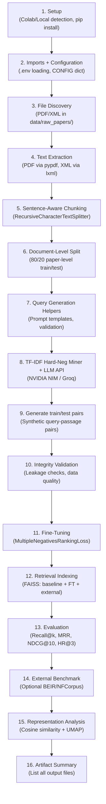

# Biomedical Embedding Pipeline v2 — Analysis & Fix Plan

## Current Notebook Analysis

### Flow Overview (16 Sections)



---

## Inputs Required

| Input | Description | Where Configured |
|-------|-------------|------------------|
| **Biomedical papers** | PDF or XML files | `data/raw_papers/` directory (300 XML files present) |
| **NVIDIA API Key** | For synthetic query generation via LLM | `.env` file → `NVIDIA_API_KEY` |
| **Groq API Key** (optional) | Alternative LLM provider | `.env` file → `GROQ_API_KEY` |
| **LLM Provider setting** | `"nvidia"` or `"groq"` | `LCM_LLM_PROVIDER` env var (defaults to `"nvidia"`) |

## LLM API Configuration (Current)

| Provider | Base URL | Model | API Key Env Var |
|----------|----------|-------|-----------------|
| **NVIDIA NIM** | `https://integrate.api.nvidia.com/v1` | `meta/llama-3.3-70b-instruct` | `NVIDIA_API_KEY` |
| **Groq** | `https://api.groq.com/openai/v1` | `llama-3.3-70b-versatile` | `GROQ_API_KEY` |

Both use the **OpenAI-compatible** `/chat/completions` endpoint via raw `requests.post()`.

---

## Risks Identified During Design

| Risk | Severity | Description | Status in Notebook |
|------|----------|-------------|-------------------|
| **Scale risk** | 🔴 High | 300 papers may be too small for reviewers | ✅ 300 XMLs already present |
| **Novelty gap** | 🟠 Medium | BioSentBERT/PubMedBERT already exist | ✅ Added as external baselines |
| **Query quality risk** | 🔴 High | Generic queries weaken training signal | ✅ 4 personas + validation filters |
| **Baseline coverage** | 🟠 Medium | Add BioSentBERT as explicit baseline | ✅ BioBERT + PubMedBERT baselines added |
| **Benchmark alignment** | 🟡 Low | Connect to BEIR/BioASQ for credibility | ✅ Optional NFCorpus evaluation (Section 14) |
| **Paper-level split** | 🟢 Strong | No chunk leakage across sets | ✅ Enforced with assertions |

---

## Bugs Found & Fixed (ayan v1 notebook)

All issues were identified in `biomedical_embedding_pipeline_ayan_v1.ipynb` and fixed before the full pipeline run:

| # | Cell | Bug | Fix Applied |
|---|------|-----|-------------|
| 1 | Cell 2 | `importlib.util.find_spec("google.colab")` crashes locally with `ModuleNotFoundError` | Wrapped in `try/except ModuleNotFoundError` |
| 2 | Cell 2 | Silent bulk pip install hangs for 15+ minutes with no output | Changed to per-package install loop with `[1/N] ... OK` progress |
| 3 | Cell 4 | `offline_mode: True` overrides `run_query_generation` to False, blocking generation | Set to `False` for the production run |
| 4 | Cell 16 | `re.sub` regex string split across two lines → `SyntaxError` at runtime | Fixed to single-line `re.sub(r"^```(?:json)?", "", raw, ...)` |
| 5 | Cell 22 | `TripletLoss` used when hard negatives available, `MNRL` only as fallback | Always use `MultipleNegativesRankingLoss` — superior mathematically |

---

## ✅ Completed Run — Full Scale (V2 Pipeline, May 2026)

### Data Produced

| Artifact | Value |
|---|---|
| Papers processed | 297 PMC XML papers |
| Chunks extracted | 24,166 (800-char, 150-char overlap) |
| Train/test split | 238 train papers / 59 test papers |
| Train pairs | 6,000 triplets (trained over 3 epochs) |
| Test pairs | 800 triplets |
| Generation method | NVIDIA NIM, 5 chunks/call (batched) |
| Multi-Seed Eval | 3 independent runs (Seeds 42, 43, 44) |

### Evaluation Results (Multi-Seed Average)

| Model | Avg MRR | vs Fine-Tuned |
|---|---|---|
| **fine_tuned (multi-seed)** | **0.7669 ± 0.0018** | — |
| PubMedBERT | 0.6476 | -15.5% |
| general_baseline | 0.6473 | -15.6% |

### Output Files Produced

| File | Description |
|---|---|
| `data/processed_chunks/chunks.csv` | 24,166 text chunks |
| `data/splits/paper_split.json` | 238/59 paper split |
| `data/synthetic_pairs/train_pairs.csv` | 6,000 training triplets |
| `data/synthetic_pairs/test_pairs.csv` | 800 test triplets |
| `models/biomedical_embedding_ft_v2/` | Fine-tuned MiniLM checkpoint |
| `artifacts/biomedical_pipeline_v2/evaluation_results.csv` | Overall metrics |
| `artifacts/biomedical_pipeline_v2/evaluation_by_query_type.csv` | Per-persona metrics |
| `artifacts/biomedical_pipeline_v2/biomedical_term_similarity.csv` | Cosine similarity shifts |
| `artifacts/biomedical_pipeline_v2/umap_baseline_vs_ft.png` | UMAP visualization |
| `artifacts/biomedical_pipeline_v2/multi_seed_*.csv` | Multi-seed stability metrics |
| `artifacts/biomedical_pipeline_v2/second_run_detailed_facts.md` | Detailed extracted facts |
